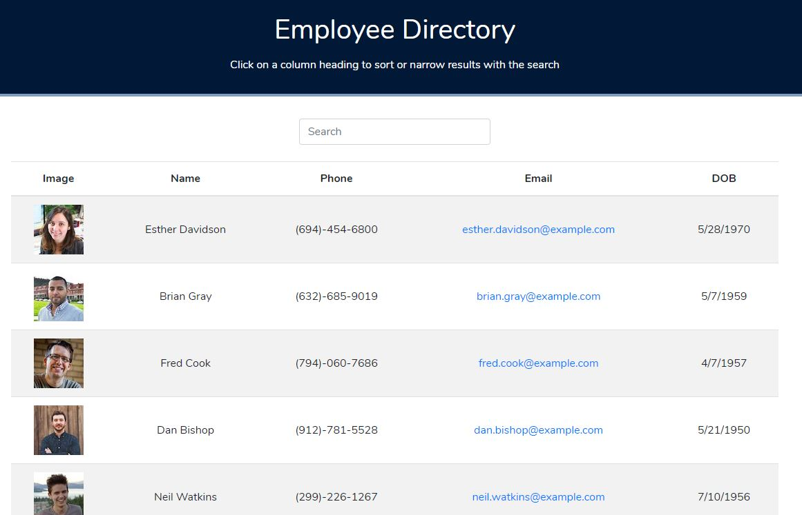

# Employee Directory

## Description

Employee Directory is a web application that allows users to see a list of employees for the company, as well as filter by search and sort columns by ascending/descending order. The application is built with React and break's up the UI into components, which manage state and respond to user events. The data in the application comes from a random user generator (https://randomuser.me/)

## Table of Contents

- [Installation](#installation)
- [Usage](#usage)
- [Example Usage](#example-usage)
- [License](#license)
- [Contributing](#contributing)
- [Questions](#questions)

## Installation

To install the required dependencies, run `npm install`

## Usage

To start the react app, run `npm start`. To access the app after starting the react app, go to http://localhost:3000 in your browser.

## Example Usage

Deployed App: https://ryan-harris.github.io/react-employee-directory

A screenshot of the application is below.

## License

This project is licensed under the MIT License - see the [LICENSE](LICENSE) file for details.

## Contributing

If you want to contribute, open a Pull Request and include a detailed description and screenshots of the changes.

## Questions

If you have any questions about the repo, open an issue or contact [ryan-harris](https://github.com/ryan-harris) directly at harris.ucla@gmail.com.
